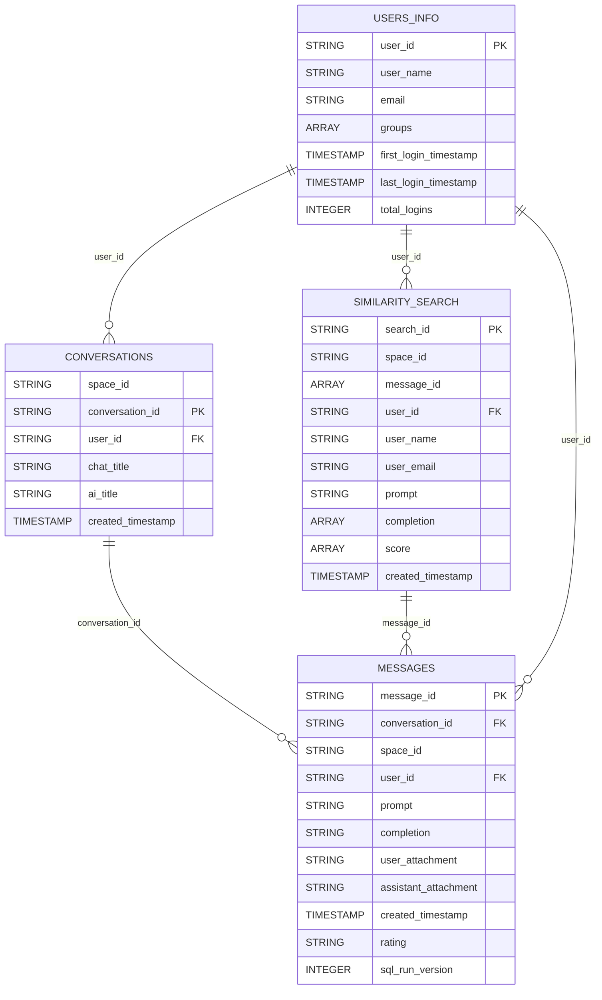

# Conversations storage - Genie Room

This module stores persistently all conversations, messages, similarity search and user info. exchanged between users and Genie assistant.

## Tables

## 1. Conversations
**Purpose:**
Saves conversations initialized by a user within app's underlying Genie Space.

**Schema:**
- `space_id` (STRING): space ID provided by Genie.
- `conversation_id` (STRING): PK → conversation ID provided by Genie.
- `user_id` (STRING): App user. This id is collected from Genie.
- `chat_title` (STRING): Original chat title.
- `ai_title` (STRING): ai generated title.
- `created_timestamp` (TIMESTAMP): conversation created timestamp.

```
CREATE TABLE {CATALOG}.{SCHEMA}.conversations (
    space_id STRING COMMENT "Genie Space ID",
    conversation_id STRING NOT NULL PRIMARY KEY COMMENT "Genie conversation_id",
    user_id STRING NOT NULL COMMENT "Genie user_id" REFERENCES {CATALOG}.{SCHEMA}.users_info (user_id),
    chat_title STRING COMMENT "Conversation title",
    ai_title STRING COMMENT "Conversation AI generated title",
    created_timestamp TIMESTAMP COMMENT "Conversation timestamp"
) USING DELTA
PARTITIONED BY (user_id)
COMMENT "Genie conversations from chatbot application"
```

## 2. Messages
**Purpose:**
Stores each message associated to a conversation.

**Schema:**
- `message_id` (STRING): message id collected from Genie, shared by user/assistant interaction.
- `conversation_id` (STRING): FK → conversations.conversation_id
- `space_id` (STRING): space ID provided by Genie.
- `user_id` (STRING)
- `prompt` (STRING): user prompt
- `completion` (STRING): assistant completion in natural language.
- `user_attachment` (STRING): filename (if exists).
- `assistant_attachment` (STRING): SQL query.
- `created_timestamp` (TIMESTAMP): message created timestamp.
- `rating` (STRING): assistant message rating sent by the user (positive | negative).
- `sql_run_version` (INTEGER): Assistant SQL statement run version. This one helps tracking re-executed SQL Statements.

```
CREATE TABLE {CATALOG}.{SCHEMA}.messages (
    message_id STRING NOT NULL PRIMARY KEY COMMENT "Genie message id",
    conversation_id STRING NOT NULL COMMENT "Genie conversation id" REFERENCES {CATALOG}.{SCHEMA}.conversations (conversation_id),
    space_id STRING COMMENT "Genie Space ID",
    user_id STRING NOT NULL COMMENT "Genie user id" REFERENCES {CATALOG}.{SCHEMA}.users_info (user_id),
    prompt STRING COMMENT "User prompt",
    completion STRING COMMENT "Assistant completion",
    user_attachment STRING COMMENT "User attachment file name",
    assistant_attachment STRING COMMENT "Assistant SQL query",
    created_timestamp TIMESTAMP COMMENT "Message timestamp",
    rating STRING COMMENT "assistant message rating by the user",
    sql_run_version INTEGER COMMENT "SQL statement run version for the message"
) USING DELTA
PARTITIONED BY (conversation_id)
COMMENT "Genie conversation messages from chatbot application"
```

## 3. Similarity Search
**Purpose:**
Stores each semantic search for the same specified Genie Space.

**Schema:**
- `search_id` (STRING): Semantic search id, generated incrementally by default
- `space_id` (STRING): Space ID provided by Genie.
- `message_id` (ARRAY): Message ID from messages table.
- `user_id` (STRING): Databricks' User ID from who perform semantic search
- `user_name` (STRING): Databricks' User name from who perform semantic search
- `user_email` (STRING): User email from who perform semantic search
- `prompt` (STRING): User prompt
- `completion` (ARRAY): Top 3 search results, in natural language.
- `score` (ARRAY): Semantic search scoring (0 to 1), being 1 a perfect match.
- `created_timestamp` (TIMESTAMP): Semantic search created timestamp.

```
CREATE TABLE {CATALOG}.{SCHEMA}.similarity_search (
  search_id BIGINT GENERATED ALWAYS AS IDENTITY PRIMARY KEY COMMENT "Unique search id",
  space_id STRING COMMENT "Genie Space ID",
  message_id ARRAY<STRING> COMMENT "Message ID from messages table",
  user_id STRING NOT NULL COMMENT "Databricks User ID" REFERENCES {CATALOG}.{SCHEMA}.users_info (user_id),
  user_name STRING COMMENT "Databricks User name from who perform semantic search"
  user_email STRING COMMENT "User email",
  prompt STRING COMMENT "User question",
  completion ARRAY<STRING> COMMENT "Search results",
  score ARRAY<FLOAT> COMMENT "Semantic search score (0 to 1), being 1 a perfect match",
  created_timestamp TIMESTAMP COMMENT "Search timestamp"
) USING DELTA
PARTITIONED BY (user_id)
COMMENT "Similarity search from Car Park chatbot application"
```

## 4. Users
**Purpose:**
Stores application user and session info.

**Schema:**
- `user_id` (STRING): Databricks' User ID
- `user_name` (STRING): User Name.
- `email` (STRING): User Email.
- `groups` (ARRAY): Databricks User groups.
- `first_login_timestamp` (TIMESTAMP): Timestamp of the User's first login ever.
- `last_login_timestamp` (TIMESTAMP): Timestamp of the User's latest login.
- `total_logins` (INTEGER): User's total logins.

```
CREATE TABLE {CATALOG}.{SCHEMA}.users_info (
  user_id STRING NOT NULL PRIMARY KEY COMMENT "Databricks User ID",
  user_name STRING COMMENT "User Name",
  email STRING COMMENT "User Email",
  groups ARRAY COMMENT "Databricks User groups",
  first_login_timestamp TIMESTAMP COMMENT "Timestamp of user first login ever",
  last_login_timestamp TIMESTAMP COMMENT "Timestamp of user latest login",
  total_logins INTEGER COMMENT "Total logins of the user"
) USING DELTA
PARTITIONED BY (user_id)
COMMENT "User information from Car Park chatbot application"
```

## Flow
1. The API calls genie_room.`start_new_conversation()`.
2. It saves the conversation as record in `conversations` table.
3. Also stores initial messages in `messages` table.
4. When calling genie_room.`continue_conversation()`, each additional message goes exclusively to `messages` table.
5. When invoked, genie_room.`delete_conversation()` deletes conversation from Genie and both DB tables.
6. When invoked, genie_room.`semantic_search()` retrieves top 3 results by similarity, storing query in `similarity_search` table.

